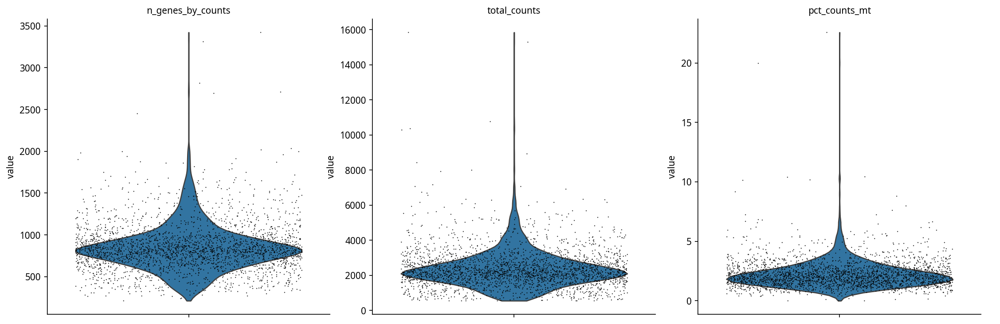
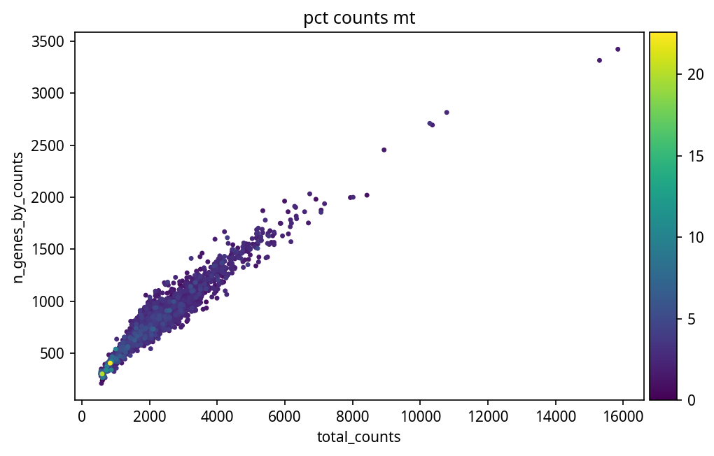
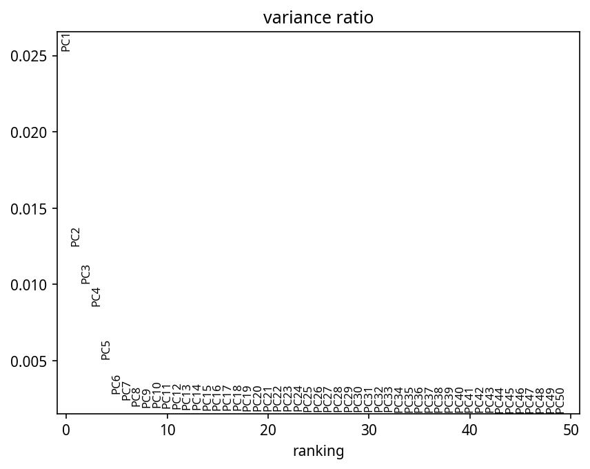
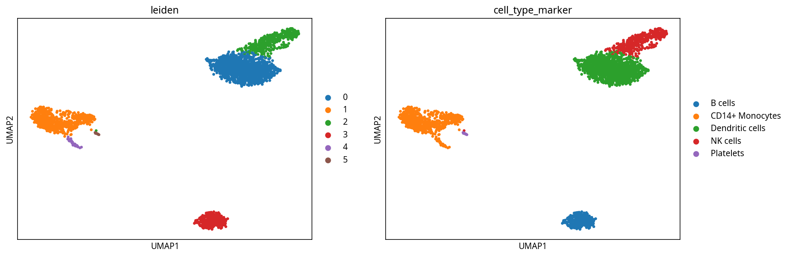
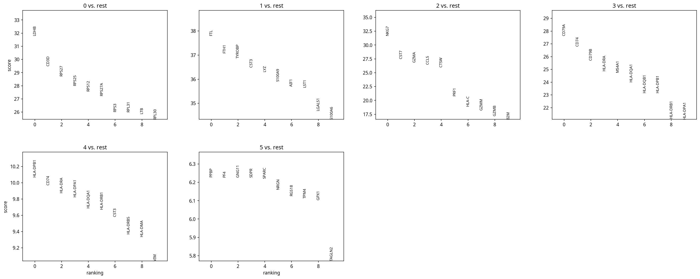
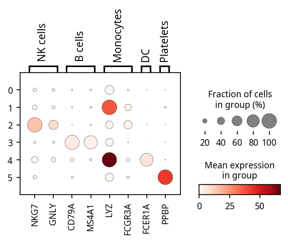
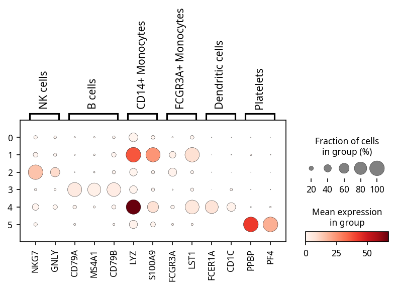
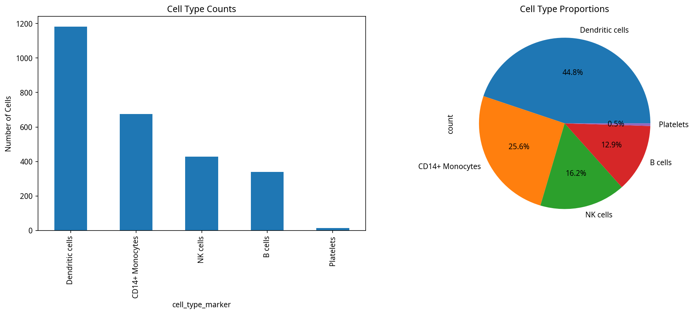
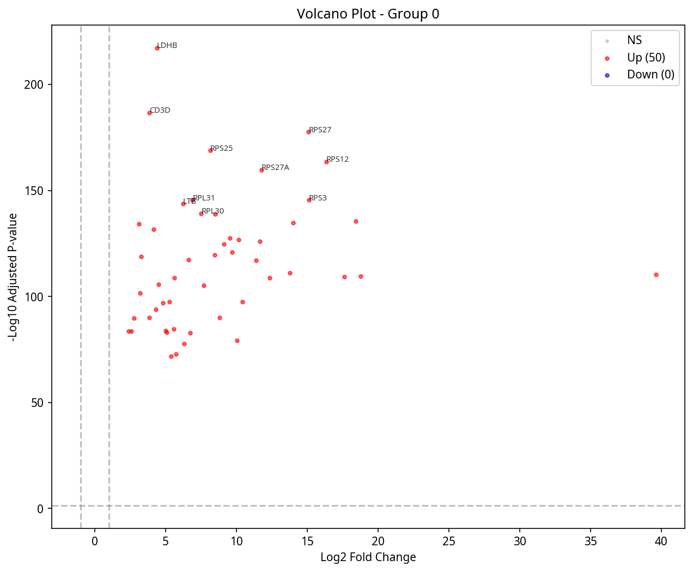

# CellAgent 端到端测试报告

本报告展示了 CellAgent 在 PBMC3k 数据集上的两种使用模式的完整测试结果，包括输入代码、输出结果和生成的可视化图表。

---

## 1. Agent 模式测试 (Agent Mode)

Agent 模式下，用户只需提供自然语言指令，CellAgent 通过 ReAct 推理循环自主完成全部分析步骤。

### 输入代码

```python
from cellagent import CellAgent, CellAgentConfig

config = CellAgentConfig(
    llm_model="gpt-4.1-mini",
    temperature=0.1,
    max_iterations=15,
    verbose=True,
    use_resource_retriever=False,
)

agent = CellAgent(config=config, output_dir="./output/agent_e2e_test")

query = (
    "Please analyze the PBMC3k dataset step by step:\n"
    "1. Load the PBMC3k dataset using sc.datasets.pbmc3k()\n"
    "2. Calculate QC metrics and filter cells (min_genes=200, max_genes=2500, max_pct_mt=5)\n"
    "3. Normalize (target_sum=1e4), log-transform, and select 2000 HVGs\n"
    "4. Run PCA (50 components), compute neighbors (n_neighbors=10, n_pcs=40)\n"
    "5. Run Leiden clustering (resolution=0.5) and compute UMAP\n"
    "6. Find marker genes for each cluster\n"
    "7. Annotate cell types using known PBMC markers\n"
    "8. Save the final annotated AnnData to output directory"
)

result = agent.run(query)
print(result)
```

### 输出结果

```text
============================================================
CELLAGENT ANALYSIS REPORT
============================================================

Query: Please analyze the PBMC3k dataset step by step: ...
Iterations: 12
Output directory: ./output/agent_e2e_test

Generated files:
  - marker_dotplot.png (126,668 bytes)
  - marker_genes.png (204,135 bytes)
  - pbmc3k_annotated.h5ad (321,805,696 bytes)
  - pca_elbow.png (34,950 bytes)
  - qc_scatter.png (67,586 bytes)
  - qc_violin.png (178,189 bytes)
  - umap.png (79,369 bytes)

Final dataset state:
AnnData: adata
  Shape: 2638 cells x 13656 genes
  Obs columns: ['n_genes_by_counts', 'total_counts', 'total_counts_mt',
    'pct_counts_mt', 'total_counts_ribo', 'pct_counts_ribo', 'leiden',
    'score_CD4+_T_cells', 'score_CD8+_T_cells', 'score_Naive_T_cells',
    'score_Memory_T_cells', 'score_Regulatory_T_cells', 'score_NK_cells',
    'score_B_cells', 'score_Plasma_cells', 'score_CD14+_Monocytes',
    'score_CD16+_Monocytes', 'score_Dendritic_cells', 'score_Plasmacytoid_DC',
    'score_Platelets', 'score_Erythrocytes', 'cell_type_marker']
  Obsm keys: ['X_pca', 'X_umap']
  Uns keys: ['log1p', 'hvg', 'pca', 'neighbors', 'leiden', 'umap', 'rank_genes_groups']
  Raw: (2638, 13656)

Analysis Result:
The PBMC3k single-cell RNA-seq dataset was analyzed end-to-end following best
practices. After filtering cells with 200-2500 genes and mitochondrial content
below 5%, the data was normalized and log-transformed. 2000 highly variable genes
were selected, PCA and neighbor graph computed, and Leiden clustering (resolution
0.5) was performed. UMAP embedding was generated for visualization. Marker genes
per cluster were identified, and cell types were annotated using curated PBMC
marker genes. The final annotated AnnData object was saved as
"pbmc3k_annotated.h5ad" in "./output/agent_e2e_test".
```

### Agent 执行过程

Agent 在 12 轮迭代中自主完成了分析，包含自动纠错（11 步代码执行，其中 4 步遇到错误后自动修复）。

| 步骤 | 状态 | 操作 |
|------|------|------|
| Step 1 | ERR -> 自动修复 | 加载数据、计算 QC |
| Step 2 | OK | 过滤低质量细胞 |
| Step 3-4 | ERR -> 自动修复 | 手动过滤尝试（自动纠正） |
| Step 5 | OK | 重新加载并完成 QC 过滤 |
| Step 6 | ERR -> 自动修复 | 归一化（参数修正） |
| Step 7 | OK | 归一化 + HVG 选择 |
| Step 8 | OK | PCA + Neighbors + Leiden + UMAP |
| Step 9 | OK | 标记基因鉴定 |
| Step 10 | OK | 细胞类型注释 |
| Step 11 | OK | 保存 AnnData |

**总耗时**: 59.9 秒

---

## 2. 直接工具模式测试 (Direct Tool Mode)

直接工具模式下，用户逐步调用 CellAgent 提供的工具函数，获得每一步的详细输出。

### 输入代码

```python
import scanpy as sc
from cellagent.tools.preprocessing import (
    calculate_qc_metrics, filter_cells_and_genes,
    normalize_and_log_transform, select_highly_variable_genes, run_pca
)
from cellagent.tools.clustering import (
    compute_neighbors, run_umap, run_leiden_clustering,
    evaluate_clustering_quality
)
from cellagent.tools.annotation import find_marker_genes, annotate_with_markers
from cellagent.tools.differential import differential_expression, volcano_plot
from cellagent.tools.visualization import (
    plot_umap_colored, plot_dotplot, plot_cell_composition,
    generate_analysis_summary
)

output_dir = "./output/direct_tools_test"

# Step 1: Load Data
adata = sc.datasets.pbmc3k()
adata.var_names_make_unique()

# Step 2: QC Metrics
qc_result = calculate_qc_metrics(adata, output_dir=output_dir)

# Step 3: Filter Cells
filter_result = filter_cells_and_genes(
    adata, min_genes=200, max_genes=2500, min_cells=3, max_pct_mt=5
)

# Step 4: Normalize
norm_result = normalize_and_log_transform(adata, target_sum=1e4)

# Step 5: HVG Selection
hvg_result = select_highly_variable_genes(adata, n_top_genes=2000, flavor="seurat")
adata = adata[:, adata.var["highly_variable"]].copy()

# Step 6: PCA
pca_result = run_pca(adata, n_comps=50, output_dir=output_dir)

# Step 7: Neighbors
neighbor_result = compute_neighbors(adata, n_neighbors=10, n_pcs=40)

# Step 8: Leiden Clustering
leiden_result = run_leiden_clustering(adata, resolution=0.5)

# Step 9: Clustering Quality
quality_result = evaluate_clustering_quality(adata)

# Step 10: UMAP
umap_result = run_umap(adata, min_dist=0.3, output_dir=output_dir)

# Step 11: Marker Genes
marker_result = find_marker_genes(adata, groupby="leiden", n_genes=10, output_dir=output_dir)

# Step 12: Cell Type Annotation
pbmc_markers = {
    "CD4+ T cells": ["CD3D", "CD3E", "IL7R"],
    "CD8+ T cells": ["CD3D", "CD3E", "CD8A", "CD8B"],
    "NK cells": ["NKG7", "GNLY", "KLRD1"],
    "B cells": ["CD79A", "MS4A1", "CD79B"],
    "CD14+ Monocytes": ["CD14", "LYZ", "S100A9"],
    "FCGR3A+ Monocytes": ["FCGR3A", "MS4A7", "LST1"],
    "Dendritic cells": ["FCER1A", "CD1C"],
    "Platelets": ["PPBP", "PF4"],
}
annot_result = annotate_with_markers(adata, pbmc_markers, output_dir=output_dir)

# Step 13: Visualization
plot_umap_colored(adata, color=["leiden", "cell_type_marker"],
                  output_dir=output_dir, filename="umap_annotated.png")

dotplot_markers = {
    "T cells": ["CD3D", "CD3E", "IL7R", "CD8A"],
    "NK cells": ["NKG7", "GNLY"],
    "B cells": ["CD79A", "MS4A1"],
    "Monocytes": ["CD14", "LYZ", "FCGR3A"],
    "DC": ["FCER1A"],
    "Platelets": ["PPBP"],
}
plot_dotplot(adata, marker_genes=dotplot_markers, groupby="leiden", output_dir=output_dir)
plot_cell_composition(adata, "cell_type_marker", output_dir=output_dir)

# Step 14: Differential Expression
de_result = differential_expression(
    adata, groupby="leiden", groups=["0"], reference="rest",
    method="wilcoxon", output_dir=output_dir
)
volcano_result = volcano_plot(adata, output_dir=output_dir)

# Step 15: Analysis Summary
summary_result = generate_analysis_summary(
    adata, output_dir=output_dir, title="PBMC3k Direct Tool Test"
)
```

### 各步骤输出结果

**Step 1 - 数据加载**
```text
AnnData: 2700 cells x 13714 genes
```

**Step 2 - QC 指标**
```text
QC Metrics Summary:
  Total cells: 2700
  Median genes/cell: 817.0
  Median UMI/cell: 2197.0
  Median %MT: 1.97%
  Median %Ribo: 0.00%
  Plots saved to: ./output/direct_tools_test/
```

**Step 3 - 细胞过滤**
```text
Filtering Results:
  Before: 2700 cells, 13714 genes
  After: 2638 cells, 13714 genes
  Removed: 62 cells (2.3%), 0 genes (0.0%)
  Filters applied: min_genes=200, max_genes=2500, min_cells=3, max_pct_mt=5.0
```

**Step 4 - 归一化**
```text
Normalization Complete:
  Method: Total-count normalization + log1p
  Target sum: 10000.0
  Raw counts saved to adata.raw
```

**Step 5 - HVG 选择**
```text
Highly Variable Gene Selection:
  Method: seurat
  HVGs selected: 2000 / 13714 total genes
```

**Step 6 - PCA**
```text
PCA Results:
  Components computed: 50
  Variance explained (top 10): [12.47%, 5.60%, 3.09%, 2.24%, ...]
  Elbow plot saved to: ./output/direct_tools_test/pca_elbow.png
```

**Step 8 - Leiden 聚类**
```text
Leiden Clustering Results:
  Resolution: 0.5
  Number of clusters: 6
  Cluster sizes:
    Cluster 0: 1183 cells (44.8%)
    Cluster 1: 637 cells (24.1%)
    Cluster 2: 427 cells (16.2%)
    Cluster 3: 340 cells (12.9%)
    Cluster 4: 38 cells (1.4%)
    Cluster 5: 13 cells (0.5%)
```

**Step 9 - 聚类质量评估**
```text
Clustering Quality Evaluation:
  Silhouette Score: 0.2480 (range: -1 to 1, higher is better)
  Calinski-Harabasz Index: 477.70 (higher is better)
  Cluster size CV: 0.903 (lower = more balanced)
  Assessment: Moderate clustering quality, consider adjusting resolution
```

**Step 11 - 标记基因**
```text
Marker Gene Analysis (method=wilcoxon):
  Cluster 0: LDHB (31.81), CD3D (29.51), RPS27 (28.74), RPS25 (28.02), RPS12 (27.58)
  Cluster 1: FTL (37.81), FTH1 (37.08), TYROBP (36.87), CST3 (36.50), LYZ (36.31)
  Cluster 2: NKG7 (31.71), CST7 (27.52), GZMA (26.89), CCL5 (26.51), CTSW (26.04)
  Cluster 3: CD79A (27.65), CD74 (26.82), CD79B (25.71), HLA-DRA (24.88), MS4A1 (24.76)
  Cluster 4: HLA-DPB1 (10.07), CD74 (9.97), HLA-DRA (9.87), HLA-DPA1 (9.83), HLA-DQA1 (9.69)
  Cluster 5: PPBP (6.23), PF4 (6.23), GNG11 (6.23), SDPR (6.23), SPARC (6.22)
```

**Step 12 - 细胞类型注释**
```text
Marker-Based Annotation Results:
  Cluster 0: Dendritic cells (score=-0.069, n=1183)
  Cluster 1: CD14+ Monocytes (score=27.844, n=637)
  Cluster 2: NK cells (score=10.356, n=427)
  Cluster 3: B cells (score=2.544, n=340)
  Cluster 4: CD14+ Monocytes (score=32.546, n=38)
  Cluster 5: Platelets (score=30.658, n=13)
```

**Step 14 - 差异表达分析**
```text
Differential Expression Analysis:
  Method: wilcoxon
  Group 0: 50 significant DEGs (padj<0.05)
  Top 5 upregulated:
    LDHB: logFC=4.389, padj=6.01e-218
    CD3D: logFC=3.863, padj=1.68e-187
    RPS27: logFC=15.108, padj=2.83e-178
    RPS25: logFC=8.158, padj=1.54e-169
    RPS12: logFC=16.354, padj=2.65e-164
```

**Step 15 - 分析摘要**
```text
# PBMC3k Direct Tool Test
## Dataset Overview
- Cells: 2638
- Genes: 2000
## Clustering (leiden)
- Number of clusters: 6
- Cluster 0: 1183 cells (44.8%)
- Cluster 1: 637 cells (24.1%)
- Cluster 2: 427 cells (16.2%)
- Cluster 3: 340 cells (12.9%)
- Cluster 4: 38 cells (1.4%)
- Cluster 5: 13 cells (0.5%)
## Cell Type Annotation
- Dendritic cells: 1183 cells (44.8%)
- CD14+ Monocytes: 675 cells (25.6%)
- NK cells: 427 cells (16.2%)
- B cells: 340 cells (12.9%)
- Platelets: 13 cells (0.5%)
```

### 输出文件列表

| 文件名 | 大小 | 说明 |
|--------|------|------|
| analysis_report.md | 913 B | 分析摘要报告 |
| cell_composition.png | 85 KB | 细胞类型组成图 |
| deg_results.csv | 2.5 KB | 差异表达结果表 |
| dotplot.png | 48 KB | 标记基因点图 |
| marker_dotplot.png | 70 KB | 注释用标记基因点图 |
| marker_genes.png | 148 KB | 各 cluster 标记基因图 |
| pca_elbow.png | 34 KB | PCA 碎石图 |
| qc_scatter.png | 68 KB | QC 散点图 |
| qc_violin.png | 178 KB | QC 小提琴图 |
| umap.png | 27 KB | UMAP 嵌入图 |
| umap_annotated.png | 83 KB | 注释后 UMAP 图 |
| volcano_0.png | 56 KB | 火山图 |

---

## 3. 可视化结果展示

### QC 质量控制

QC 小提琴图展示了每个细胞的基因数、UMI 总数和线粒体基因比例分布：



QC 散点图展示了基因数与 UMI 总数的关系，以及与线粒体比例的关系：



### PCA 降维

碎石图用于确定合适的主成分数量：



### UMAP 聚类与注释

UMAP 图展示了 Leiden 聚类结果和细胞类型注释：



### 标记基因分析

各 cluster 的 Top 标记基因（Wilcoxon 秩和检验）：



标记基因点图展示了已知 PBMC 标记基因在各 cluster 中的表达模式：



注释过程中使用的标记基因点图：



### 细胞类型组成

各细胞类型的数量和比例：



### 差异表达分析

Cluster 0 vs rest 的火山图：


